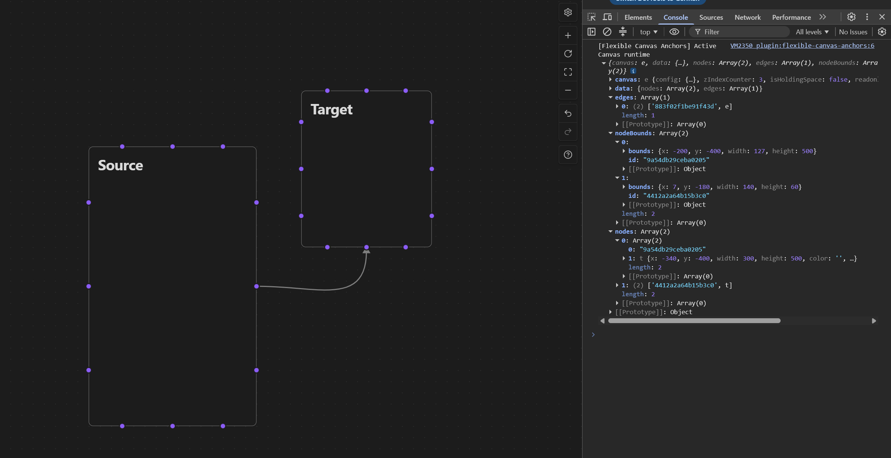

# Flexible Canvas Anchors

Flexible Canvas Anchors is an Obsidian plugin that provides more control over where edges attach to Canvas nodes.

## Problem

Obsidian Canvas allows an edge to connect to one of four sides of a node: top, right, bottom, or left.

The edge endpoint is placed in the middle of the selected side. Users cannot choose another attachment position, which
can make diagrams difficult to read when several edges are connected to the same node.

## Goal

The goal of this plugin is to provide multiple anchor points on every side of a Canvas node while preserving the native
Canvas experience.

Users should be able to choose where an edge is attached and keep that position when the Canvas is edited or reopened.

## Minimum Viable Product

The first version will provide three anchor points on every side of a node: `20%`, `50%`, and `80%`.

For example, a vertical side will have anchor points near the top, middle, and bottom.

The MVP will allow users to:

- Select an anchor point when creating an edge.
- Select a different anchor point when reconnecting an existing edge.
- Keep the selected anchor when a node is moved.
- Recalculate the anchor position when a node is resized.
- Preserve the selected anchor after closing and reopening the Canvas.
- Reset an edge endpoint to the default middle position.

## Project Status

The project is currently in active development.

The plugin scaffold is complete, and the plugin can be built and loaded successfully in Obsidian.

A read-only runtime inspection spike has confirmed on Obsidian Desktop `1.13.7` that live Canvas nodes and edges can be
accessed through an isolated internal API boundary. The inspection also confirmed that native edge endpoints store a
side but no position along that side.
The runtime findings and resulting architecture are documented in
[Canvas Runtime Inspection](docs/research/canvas-runtime-inspection.md).

The pure anchor geometry layer is now implemented independently of Obsidian. It calculates an anchor point from
a node's bounds, a side, and a ratio between `0` and `1`.
A read-only UI spike now renders three temporary anchor markers on every side of each live Canvas node.
The markers follow node movement, resizing, and Canvas zoom, and they are removed when hidden or when the plugin is disabled.
This spike does not yet create, reconnect, or persist Canvas edges.


## Technical Constraints

The official JSON Canvas format supports four connection sides but does not define a position along a side.

Obsidian also does not expose every Canvas interaction through its public plugin API. The plugin may therefore need to
interact with internal Canvas APIs.

Code that depends on internal APIs must be isolated behind an adapter so that changes in Obsidian do not require
rewriting the complete plugin.

## Technical Risks

- Internal Canvas APIs may change after an Obsidian update.
- Custom anchor data may not be understood by other Canvas applications.
- Other plugins that modify Canvas edges may cause compatibility issues.
- Edge positions and interactions must remain correct at different zoom levels.
- Large canvases must not become slower because of unnecessary edge recalculations.

## Compatibility Strategy

The plugin should extend the existing JSON Canvas data without replacing its standard properties.

If the plugin is disabled or unavailable, Obsidian should still be able to open the Canvas and display every standard
node and edge using its default behavior.

The first version targets Obsidian Desktop. Mobile compatibility will be evaluated later.

## Requirements

- Obsidian Desktop `1.13.1` or later.
- Node.js `20` or later.
- npm.
- A dedicated development vault.

Do not develop or test experimental Canvas behavior in a vault containing important notes.

## Installation for Development

Clone the repository:

```powershell
git clone https://github.com/8widerstand/flexible-canvas-anchors.git
cd flexible-canvas-anchors
```

Install the locked dependencies:

```powershell
npm ci
```

If npm reports that the esbuild installation script has not been reviewed, approve the installed esbuild version:

```powershell
npm approve-scripts esbuild
```

Create a production build:

```powershell
npm run build
```

This generates `main.js` at the project root.

## Connect a Development Vault

Obsidian expects the plugin to be available at:

```text
<vault>/.obsidian/plugins/flexible-canvas-anchors
```

On Windows, the repository can remain outside the vault by creating a directory junction.

Create the plugins directory:

```powershell
New-Item -ItemType Directory -Force -Path "<vault>\.obsidian\plugins"
```

Create the junction:

```powershell
New-Item -ItemType Junction -Path "<vault>\.obsidian\plugins\flexible-canvas-anchors" -Target "<repository>"
```

Then:

1. Open the development vault in Obsidian.
2. Open **Settings → Community plugins**.
3. Exit restricted mode.
4. Refresh the installed plugin list.
5. Enable **Flexible Canvas Anchors**.

A repository may alternatively be cloned directly into `.obsidian/plugins/flexible-canvas-anchors`.

## Development Commands

| Command              | Purpose                                                      |
|----------------------|--------------------------------------------------------------|
| `npm run dev`        | Watch source files and rebuild `main.js` during development. |
| `npm run build`      | Type-check and create a minified production bundle.          |
| `npm run lint`       | Run ESLint and the Obsidian-specific rules.                  |
| `npm test`           | Run the unit tests once.                                     |
| `npm run test:watch` | Run unit tests in watch mode.                                |

After rebuilding, reload or disable and re-enable the plugin in Obsidian to execute the new bundle.

The test commands are prepared for the geometry layer. The first tests will be added when anchor calculations are
implemented.

## Project Structure

```text
flexible-canvas-anchors/
├── src/
│   └── main.ts
├── .editorconfig
├── .gitignore
├── esbuild.config.mjs
├── eslint.config.mts
├── manifest.json
├── package.json
├── package-lock.json
├── tsconfig.json
├── versions.json
└── README.md
```

## Tech Stack

- ``TypeScript`` - ``Obsidian Plugin API`` - ``JSON Canvas`` - ``DOM and SVG APIs`` - ``esbuild`` - ``ESLint`` - ``Vitest``

## Development Workflow

Development follows a branch-based workflow:

1. Create a dedicated branch for each feature or technical step.
2. Implement and test the change.
3. Update this README when the project behavior or status changes.
4. Review the implementation and Git diff.
5. Create a focused commit.
6. Open a pull request.
7. Merge only after all checks pass.

## License

This project is licensed under the MIT License. See `LICENSE` for details.
